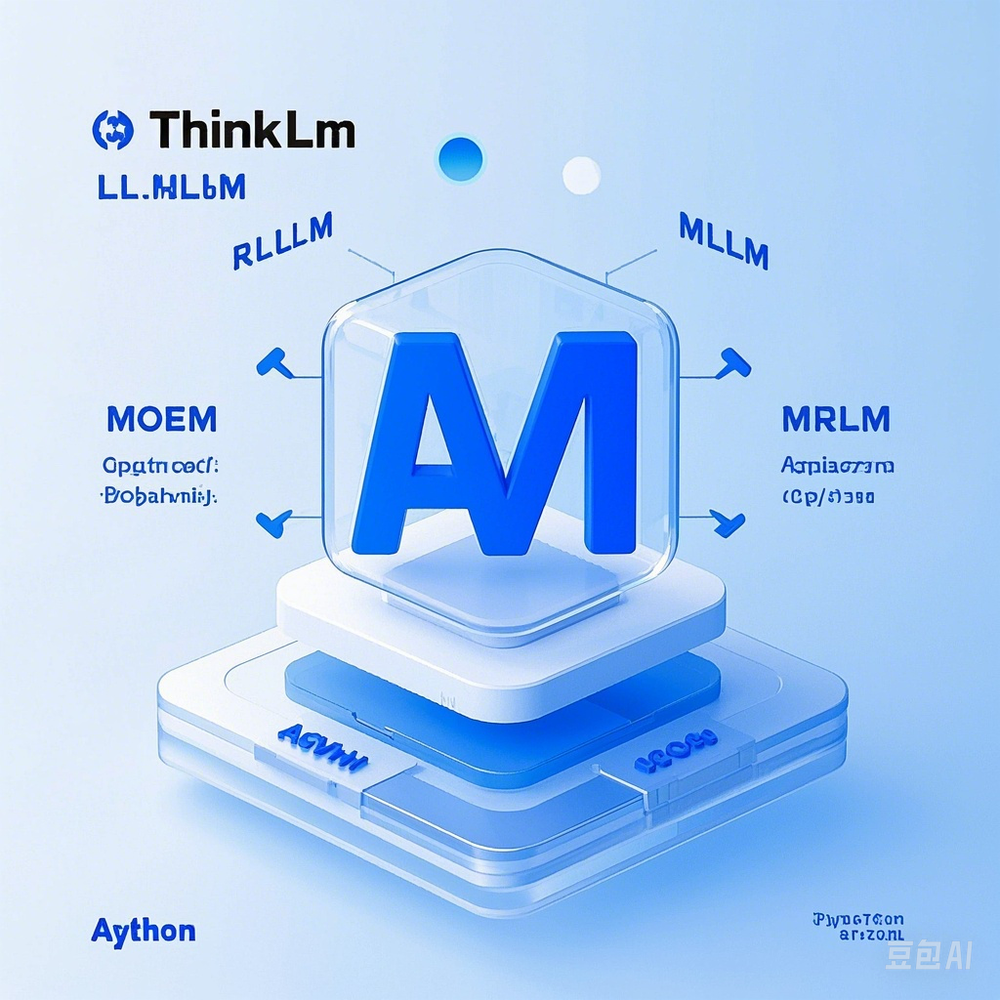
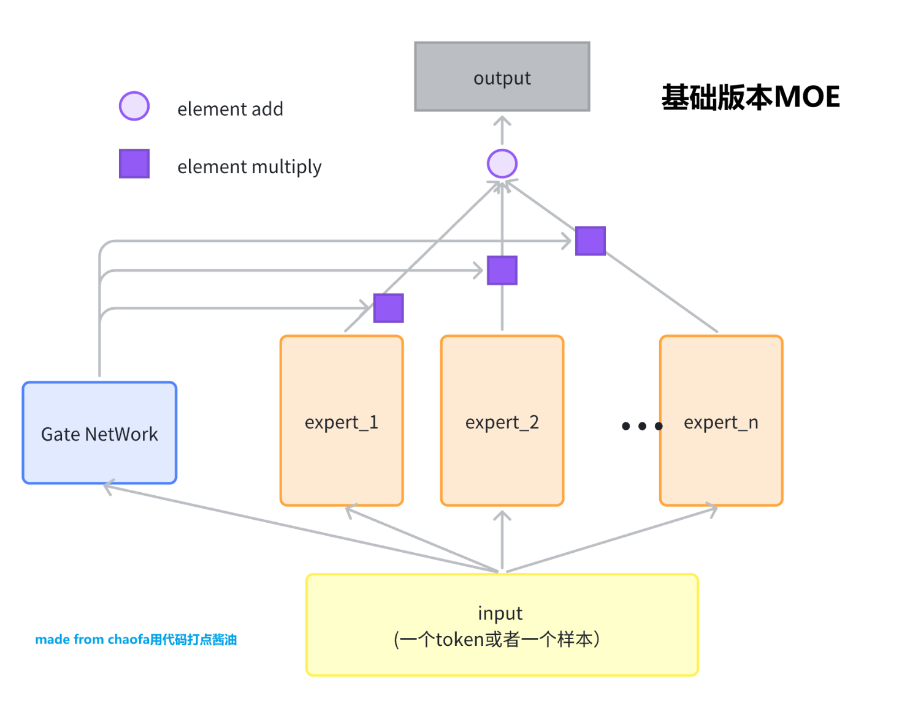

<div align="center">

# 🚀 ThinkLLM



### 大语言模型算法与组件实现 · 轻量 · 高效 · 从零复现

简体中文 | <a href="./README_en.md">English</a>

[](https://github.com/aJupyter/ThinkLLM/stargazers)
[](https://github.com/aJupyter/ThinkLLM/network)
[](https://github.com/aJupyter/ThinkLLM/issues)
[](https://github.com/aJupyter/ThinkLLM/blob/main/LICENSE)
[](https://github.com/aJupyter/ThinkLLM/pulls)

</div>

<div align="center">
  <a href="#intro">📖 项目简介</a> ·
  <a href="#updates">🔥 更新</a> ·
  <a href="#structure">🗂️ 目录结构</a> ·
  <a href="#modules">🧭 模块导航</a> ·
  <a href="#quickstart">💡 快速开始</a> ·
  <a href="#details">📦 模块详解</a> ·
  <a href="#roadmap">🗺️ Roadmap</a> ·
  <a href="#contributing">👏 贡献</a>
</div>

<a id="intro"></a>

## 项目简介 🌟

**ThinkLLM** 是一个专注于大语言模型核心算法实现的开源项目。我们用尽量少的依赖、尽量简洁的代码，从零复现 LLM / 多模态 / RAG / MoE / RL / Agent 等关键算法与组件，帮助开发者和研究者**通过可运行的代码**深入理解大模型的底层机制。

设计原则：

- **可运行**：每个模块都是一个可以独立打开就跑的 Notebook 或脚本，而非伪代码。
- **自包含**：每个 Notebook / 脚本**不依赖项目内其他文件**，单独打开即可从头执行。
- **可读懂**：优先 NumPy / 朴素 PyTorch 实现，先讲清原理再做工程优化。

> 如果你对大模型全栈实践感兴趣，可以参考完全开源的 [EmoLLM](https://github.com/SmartFlowAI/EmoLLM)。
> 也可以使用 [DeepWiki](https://deepwiki.com/aJupyter/ThinkLLM) 辅助理解本项目。

<a id="updates"></a>

## 更新 🔥

- **[2025.6]** 新增 [Agent 模块](./agent)：ReAct / CoT / 反思 / ToT（手写 demo + 工具 hack）；新增 [RL 模块](./rl)：PPO / GRPO Loss 从零实现；统一并规范化目录结构
- **[2025.5]** 支持 [DeepWiki](https://deepwiki.com/aJupyter/ThinkLLM) 辅助阅读；新增 [MLA / FlashAttention](./transformer/mla_flash_attention.ipynb)、[多模态](./multimodal) 系列
- **[2025.4]** 新增 [RAG 算法库](./rag)、[BPE 分词](./tokenizer/bpe.ipynb)
- **[2025.3]** 新增 [MHA / GQA / MQA](./transformer/attention_mha_gqa_mqa_mla.ipynb)、[ViT](./multimodal/vit.ipynb)

<a id="structure"></a>

## 目录结构 🗂️

```
ThinkLLM/
├── transformer/     # Transformer 核心组件（注意力 / 位置编码 / 归一化 …）
├── tokenizer/       # 分词算法（BPE …）
├── multimodal/      # 多模态（ViT / 特征提取 / 跨模态投影）
├── rag/             # 检索增强生成算法库（向量检索 / 检索优化）
├── moe/             # 混合专家模型（MoE）
├── rl/              # 强化学习对齐（PPO / GRPO …）
├── agent/           # Agent 算法（ReAct / CoT / 反思 / ToT）
├── images/          # 仓库公共图片资源
├── README.md
└── README_en.md
```

> 命名规范：目录与文件统一使用**小写 + 下划线（snake_case）**，不含空格与特殊字符。

> 📂 **各模块文档导航**：[transformer](./transformer/README.md) · [tokenizer](./tokenizer/README.md) · [multimodal](./multimodal/README.md) · [rag](./rag/README.md) · [moe](./moe/README.md) · [rl](./rl/README.md) · [agent](./agent/README.md)

<a id="modules"></a>

## 模块导航 🧭

下表是目前**已经实现**的内容总览。点击「**模块**」进入对应文件夹的说明文档，点击「**入口文件**」直接阅读 / 运行。`状态` 中 ✅ 表示已实现，🚧 表示规划中（见文末 [Roadmap](#规划路线图-roadmap)）。

| 模块 | 主题 | 入口文件 | 形式 | 状态 |
| --- | --- | --- | --- | --- |
| [📂 transformer](./transformer/README.md) | Transformer 全组件（NumPy 复现） | [`transformer_basics.ipynb`](./transformer/transformer_basics.ipynb) | Notebook | ✅ |
| [📂 transformer](./transformer/README.md) | MHA / GQA / MQA（概念 + 原理） | [`attention_mha_gqa_mqa.ipynb`](./transformer/attention_mha_gqa_mqa.ipynb) | Notebook | ✅ |
| [📂 transformer](./transformer/README.md) | MHA / GQA 模块化实现 | [`attention_mha_gqa_mqa_mla.ipynb`](./transformer/attention_mha_gqa_mqa_mla.ipynb) | Notebook | ✅ |
| [📂 transformer](./transformer/README.md) | 线性注意力 / FlashAttention | [`mla_flash_attention.ipynb`](./transformer/mla_flash_attention.ipynb) | Notebook | ✅ |
| [📂 tokenizer](./tokenizer/README.md) | BPE 分词器训练与评估 | [`bpe.ipynb`](./tokenizer/bpe.ipynb) | Notebook | ✅ |
| [📂 multimodal](./multimodal/README.md) | ViT（Vision Transformer） | [`vit.ipynb`](./multimodal/vit.ipynb) | Notebook | ✅ |
| [📂 multimodal](./multimodal/README.md) | 图像特征提取与映射 | [`image_feature_extraction.ipynb`](./multimodal/image_feature_extraction.ipynb) | Notebook | ✅ |
| [📂 multimodal](./multimodal/README.md) | 跨模态投影层与融合 | [`projection_layer.ipynb`](./multimodal/projection_layer.ipynb) | Notebook | ✅ |
| [📂 rag](./rag/README.md) | 向量检索 + 检索优化算法库 | [`rag/`](./rag) · [说明](./rag/README.md) | 脚本 + Notebook | ✅ |
| [📂 moe](./moe/README.md) | 基础 MoE 与 Sparse MoE | [`moe.ipynb`](./moe/moe.ipynb) | Notebook | ✅ |
| [📂 rl](./rl/README.md) | PPO / GRPO Loss 从零实现 | [`ppo_grpo_loss.ipynb`](./rl/ppo_grpo_loss.ipynb) | Notebook | ✅ |
| [📂 agent](./agent/README.md) | ReAct / CoT / 反思 / ToT（含手写 demo） | [`react_agent.ipynb`](./agent/react_agent.ipynb) | Notebook | ✅ |

<a id="quickstart"></a>

## 环境与快速开始 💡

```bash
# 1. 克隆仓库
git clone https://github.com/aJupyter/ThinkLLM.git
cd ThinkLLM

# 2. 安装常用依赖（不同模块按需安装）
pip install numpy torch matplotlib jupyter
pip install jieba          # rag 中文分词
pip install tokenizers     # tokenizer(BPE) 模块

# 3. 打开任意 Notebook 学习
jupyter notebook
```

> 各模块相互独立，没有统一的 `requirements.txt`。每个 Notebook / 脚本均**自包含**，单独打开即可运行。

---

<a id="details"></a>

## 已实现模块详解 📦

### 1. Transformer 核心组件（[`transformer/`](./transformer/README.md)）

> 从零理解一个 Transformer 是如何"算"出来的：注意力、位置编码、归一化、前馈网络逐个拆解。

| 文件 | 你将学到 | 关键实现 |
| --- | --- | --- |
| [`transformer_basics.ipynb`](./transformer/transformer_basics.ipynb) | 纯 NumPy 复现完整 Transformer，理解每一步矩阵运算 | `softmax` · `positional_encoding` · `scaled_dot_product_attention` · `multi_head_attention` · `feed_forward_network` · `layer_norm` · `encoder_layer` · `decoder_layer` |
| [`attention_mha_gqa_mqa.ipynb`](./transformer/attention_mha_gqa_mqa.ipynb) | MHA / MQA / GQA 的概念、原理与显存对比 | 三种注意力的对比与 PyTorch 实现 |
| [`attention_mha_gqa_mqa_mla.ipynb`](./transformer/attention_mha_gqa_mqa_mla.ipynb) | 用 `nn.Module` 封装多头与分组查询注意力 | `MultiHeadAttention` · `GroupQueryAttention` |
| [`mla_flash_attention.ipynb`](./transformer/mla_flash_attention.ipynb) | 线性注意力的计算简化、FlashAttention 的分块思想 | `Linear Attention` · `FlashAttention` |

**动手建议**：先读 `transformer_basics`（NumPy 直观版），再看 `attention_*`（理解显存优化），最后看 `mla_flash_attention`（理解推理加速）。

### 2. Tokenization 分词（[`tokenizer/`](./tokenizer/README.md)）

> 模型看到的是 token，不是文字。本模块讲清楚 BPE 是怎么"学会"切词的。

| 文件 | 你将学到 | 关键实现 |
| --- | --- | --- |
| [`bpe.ipynb`](./tokenizer/bpe.ipynb) | BPE 的训练流程（统计相邻对 → 合并最高频对 → 迭代）与编解码流程 | `train_tokenizer` · `eval_tokenizer`，配套语料 [`bpe.jsonl`](./tokenizer/bpe.jsonl) |

### 3. 多模态算法（[`multimodal/`](./multimodal/README.md)）

> 让模型"看懂"图像：从图像切块编码，到把视觉特征对齐进语言空间。

| 文件 | 你将学到 | 关键步骤 |
| --- | --- | --- |
| [`vit.ipynb`](./multimodal/vit.ipynb) | Vision Transformer 全流程 | Patch Embedding → 位置编码 → Transformer Encoder → 完整 ViT → 分块可视化 |
| [`image_feature_extraction.ipynb`](./multimodal/image_feature_extraction.ipynb) | 图像特征的提取与映射 | 特征提取器 → 特征映射模块 → 完整流水线 → 特征可视化 → 端到端示例 |
| [`projection_layer.ipynb`](./multimodal/projection_layer.ipynb) | 跨模态投影与对齐 | 投影层设计 → 跨模态融合层 → 对比学习 → 端到端训练 |

### 4. 检索增强生成 RAG（[`rag/`](./rag/README.md)）

> 一套**可一键运行**的 RAG 算法库，覆盖向量检索与检索优化两大类。详见 [rag/README.md](./rag/README.md)。

**一键体验**（从仓库根目录运行）：

```bash
python -m rag.rag_algorithms_demo
```

| 子模块 | 文件 | 关键实现 |
| --- | --- | --- |
| 向量检索 | [`cosine_dot_product_similarity.py`](./rag/vector_retrieval/cosine_dot_product_similarity.py) | `cosine_similarity` · `dot_product_similarity` |
| 向量检索 | [`approximate_nearest_neighbor.py`](./rag/vector_retrieval/approximate_nearest_neighbor.py) | LSH 近似最近邻 `LSHIndex` |
| 向量检索 | [`hnsw_index.py`](./rag/vector_retrieval/hnsw_index.py) | HNSW 索引 `HNSWIndex` |
| 向量检索 | [`context_compression.py`](./rag/vector_retrieval/context_compression.py) | 上下文压缩 `ContextCompressor` · `MapReduceCompressor` |
| 检索优化 | [`hybrid_retrieval_sort.py`](./rag/retrieval_optimization/hybrid_retrieval_sort.py) | BM25 + 向量混合排序 `bm25_score` · `hybrid_retrieval_sort` |
| 检索优化 | [`query_rewrite_expansion.py`](./rag/retrieval_optimization/query_rewrite_expansion.py) | 查询重写与扩展 `QueryRewriter` |
| 检索优化 | [`hyde_algorithm.py`](./rag/retrieval_optimization/hyde_algorithm.py) | 假设性文档嵌入 `HyDERetriever` |
| 检索优化 | [`retrieval_reranking.py`](./rag/retrieval_optimization/retrieval_reranking.py) | 重排序（BM25 / 上下文 / RRF）`RetrievalReranker` |

### 5. 混合专家模型 MoE（[`moe/`](./moe/README.md)）

> 用最小可读的代码理解 MoE：专家、路由、稀疏激活与负载均衡。

| 文件 | 你将学到 | 关键实现 |
| --- | --- | --- |
| [`moe.ipynb`](./moe/moe.ipynb) | 从单个专家到可用于大模型训练的 Sparse MoE | `BasicExpert` · `BasicMOE` · `MOERouter`（Top-K 门控）· `MOEConfig` · `SparseMOE` |

<div align="center"></div>

### 6. 强化学习对齐 RL（[`rl/`](./rl/README.md)）

> RLHF / 大模型对齐中最常用的两种策略优化损失，**自包含、可独立运行**（仅依赖 `torch` + `numpy`）。

| 文件 | 你将学到 | 关键实现 |
| --- | --- | --- |
| [`ppo_grpo_loss.ipynb`](./rl/ppo_grpo_loss.ipynb) | PPO 与 GRPO 损失的数学原理与最小可运行实现，并附玩具模型训练步 | `compute_gae`（GAE 优势）· `ppo_loss`（裁剪目标 + 价值 + 熵）· `grpo_group_advantages`（组内标准化）· `grpo_loss`（无 Critic + k3 KL 惩罚） |

**要点**：PPO 用 GAE + Critic 估计优势；GRPO 去掉 Critic，用「同一 prompt 一组回答」的组内相对奖励作为优势，并显式加 per-token KL 惩罚（DeepSeekMath / DeepSeek-R1 路线）。

### 7. Agent 核心算法（[`agent/`](./agent/README.md)）

> Agent 推理与规划的核心范式，**自包含、纯标准库可运行**：用「工具 hack（本地字典 + 安全算术）+ mock LLM（手写规则策略）」把控制流完整跑通，无需真实大模型或联网。

| 文件 | 你将学到 | 关键实现 |
| --- | --- | --- |
| [`react_agent.ipynb`](./agent/react_agent.ipynb) | ReAct / CoT / 自我反思 / Tree-of-Thought 与工具调用解析 | `search` · `calculator`（工具 hack）· `parse_action`（方括号 / JSON 两种工具调用解析）· `react_agent`（手写 ReAct 循环）· `reflexion_loop`（反思重试）· `tot_solve_24`（思维树搜索 24 点） |

**要点**：CoT 显式写出中间步骤；ReAct 交替 `Thought → Action → Observation`；Reflexion 失败后写反思再重试；ToT 在思维树上生成分支 + 评估 + 搜索。接入真实 LLM 时只需把 mock 策略与工具替换为真实实现。

---

<a id="roadmap"></a>

## 规划路线图（Roadmap）🗺️

以下为计划中、尚未实现的内容，欢迎认领贡献（🚧）。我们希望每个条目最终都对应**一个自包含、可运行的脚本或 Notebook**。

<details>
<summary><b>Transformer 进阶</b></summary>

- 位置编码：Sinusoidal / Learnable PE / Relative PE / RoPE / ALiBi
- 归一化：RMSNorm、GroupNorm、Pre-LN vs Post-LN 对训练稳定性的影响
- 激活与 FFN：GELU / SiLU、SwiGLU、GLU 变体
- 其他分词：WordPiece、Byte-level BPE (BBPE)

</details>

<details>
<summary><b>训练与优化</b></summary>

- 预训练目标：CLM / MLM / PrefixLM / DAE
- 序列生成：Greedy / Beam Search / Nucleus / Typical Sampling / MCTS
- 优化器与策略：AdamW、Lion、学习率预热与余弦衰减、梯度累积与裁剪、混合精度(AMP)

</details>

<details>
<summary><b>高效推理与部署</b></summary>

- 推理优化：KV Cache、Continuous Batching、Paged Attention、Speculative Decoding
- 量化：INT8/INT4/NF4 权重量化、ZeroQuant、GPTQ、AWQ、QLoRA

</details>

<details>
<summary><b>长序列处理</b></summary>

- 长上下文：Position Interpolation、Sliding Window Attention、Longformer 稀疏注意力、Mamba
- 记忆增强：外部记忆检索、GateLoop、RWKV、StreamingLLM

</details>

<details>
<summary><b>Agent 与强化学习</b></summary>

- Agent 进阶：多智能体协作、长期记忆、ReWOO、Plan-and-Execute、真实工具/函数调用接入
- RL / 对齐：奖励模型训练、DPO（直接偏好优化）、偏好对比学习、对齐税度量

</details>

<a id="contributing"></a>

## 贡献指南 👏

非常欢迎任何形式的贡献！建议的贡献形式是**一个自包含、可一键运行的入口文件或 Notebook**：

1. Fork 本仓库并新建分支；
2. 在对应模块目录下添加你的实现（Notebook 或脚本），保持"先原理、后代码、可运行"且**不依赖其他脚本**的风格；
3. 文件 / 目录命名使用小写 + 下划线（snake_case）；
4. 在 README 的[模块导航](#模块导航-)表中补充入口与状态，并提交 PR 说明实现思路与运行方式。

## 参考资源 🪐

该部分持续完善，旨在分享高价值学习资料：

- 算法原理相关论文
- 优秀实现参考
- 推荐学习路径

## 许可证 😄

本项目采用 [Apache License 2.0](./LICENSE)。

## Star History ✨

[](https://star-history.com/#aJupyter/ThinkLLM&Date)

## Contributors

[](https://github.com/aJupyter/ThinkLLM/graphs/contributors)
