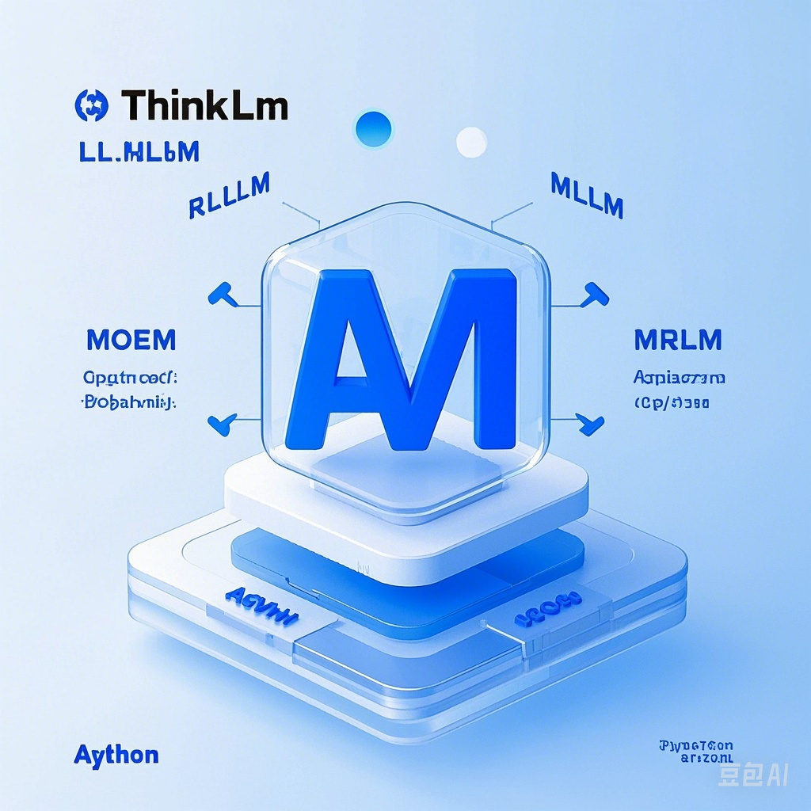

# 🚀ThinkLLM: Implementation of Large Language Model Algorithms and Components

    <a href="README.md" > 简体中文 </a>| English

## Project Overview 🌟

ThinkLLM is an open-source project focused on the implementation of core algorithms for large language models. This repository contains Python implementations of key algorithms and components for various models like LLM, MLLM, RAG, Agent, LRM, RL, and MoE, helping developers and researchers delve into the underlying mechanisms of large models through specific code. Each algorithm implementation is concise and clear, facilitating learning and secondary development.

If you're interested in full-stack practice with large models, you can refer to the fully open-source [EmoLLM](https://github.com/SmartFlowAI/EmoLLM).

  
   
  
🚀 Lightweight and Efficient Large Language Model Algorithm Implementations

  
  
  
  
  

## Updates 🔥

More and better content on the way!

- [2025.5] You can use [deepwiki](https://deepwiki.com/aJupyter/ThinkLLM) to help understand this project
- [2025.4] Updated [RAG](./RAG), [BPE](./LLM/BPE.ipynb)
- [2025.3] Updated [MHA/GQA/MQA](./transformer_component/MHA_GQA_MQA_MLA.ipynb), [VIT](./multimodal/ViT.ipynb)

## Project Outline 📖

### 1. Core Transformer Algorithms

- **Attention Mechanism Algorithms**
  - Classic Self-Attention Implementation
  - Forward and Backward Propagation of Multi-Head Attention (MHA)
  - Efficient Implementation of Grouped Query Attention (GQA)
  - Memory-Efficient Multi-Query Attention (MQA) Algorithms
  - Mixed Linear Attention (MLA) Computation and Optimization
  - FlashAttention Implementation and Performance Analysis
- **Positional Encoding Algorithms**
  - Sinusoidal Positional Encoding Implementation
  - Learnable Positional Encoding Training Algorithms
  - Relative Positional Encoding Calculation Methods
  - Mathematical Principles and Vector Transformation of Rotary Positional Encoding (RoPE)
  - Implementation of ALiBi Positional Bias Algorithm
- **Normalization Layer Algorithms**
  - Forward and Backward Propagation of LayerNorm
  - RMSNorm Algorithm and Computational Optimization
  - Application of GroupNorm in Transformers
  - Impact of Pre/Post-LN Normalization on Training Stability
- **Activation Functions and Feedforward Networks**
  - GELU/SiLU Activation Function Implementation
  - SwiGLU Gated Transformation Algorithm
  - Implementation of GLU (Gated Linear Unit) and its Variants
  - Conditional Computation in MoE-FFN (Mixture of Experts Feedforward Networks)

### 2. Model Training and Optimization Algorithms

- **Pre-training Algorithms**
  - Implementation of Causal Language Model (CLM) Pre-training Objectives
  - Masked Language Model (MLM) Training Algorithms
  - Prefix Language Model (PrefixLM) Implementation
  - Denoising Autoencoder (DAE) Training Strategy
- **Sequence Generation Algorithms**
  - Greedy Decoding Implementation
  - Beam Search Algorithm
  - Nucleus Sampling and Temperature Sampling Algorithms
  - Typical Sampling Implementation
  - Application of MCTS (Monte Carlo Tree Search) in Language Generation
- **Optimization Algorithms**
  - AdamW Optimizer and Decoupling of Weight Decay
  - Implementation of Lion Optimizer Algorithm
  - Learning Rate Warm-up and Cosine Decay Strategies
  - Gradient Accumulation and Clipping Implementation
  - Mixed Precision Training (AMP) Algorithm

### 3. Efficient Inference and Deployment Algorithms

- **Inference Optimization Algorithms**
  - KV Cache Implementation and Management Strategy
  - Continuous Batching Algorithm
  - Quantization Methods for Activation Values During Inference
  - Memory Management Algorithms for Paged Attention
  - Speculative Decoding for Inference Acceleration
- **Quantization Algorithms**
  - Weight Quantization Algorithms (INT8/INT4/NF4)
  - ZeroQuant Quantization Algorithm Implementation
  - GPTQ Quantization Process and Optimization
  - AWQ (Activation Aware Quantization) Algorithm
  - QLoRA Quantization Fine-Tuning Algorithm

### 4. Long Sequence Processing Algorithms

- **Long Context Technologies**
  - Positional Interpolation Algorithm
  - Sliding Window Attention Implementation
  - Sparse Attention Algorithm for Longformer-like Models
  - Core Algorithms of Recursive State Space Models (Mamba)
  - Efficient Recomputation Strategy Algorithm
- **Memory Augmentation Mechanisms**
  - External Memory Retrieval Algorithms
  - GateLoop Memory Augmented Cycling Mechanism
  - RWKV Linear Attention Algorithm Implementation
  - StreamingLLM Infinite Context Algorithm

### 5. Multi-Modal Algorithms

- **Visual Encoding Algorithms**
  - ViT (Vision Transformer) Basic Algorithm Implementation
  - Forward Propagation of CLIP Visual Encoder
  - Image Feature Extraction and Mapping Algorithms
  - Visual Segmentation and Feature Fusion Techniques
- **Cross-Modal Fusion Algorithms**
  - Design and Implementation of Projection Layers
  - Cross-Modal Attention Calculation Method
  - Construction Algorithm for Alignment Space
  - Visual-Language Representation Alignment Method

### 6. Retrieval-Augmented Generation (RAG) Algorithms

- **Vector Retrieval Algorithms**
  - Cosine Similarity and Dot Product Similarity Calculation
  - Fast Retrieval Algorithm for Approximate Nearest Neighbor (ANN)
  - HNSW Index Construction and Query Algorithm
  - Implementation of Hybrid Retrieval Ranking Algorithm
- **Retrieval Optimization Algorithms**
  - Query Rewrite and Expansion Algorithm
  - HyDE (Hypothetical Document Embedding) Algorithm
  - Context Compression and Information Retention Algorithms
  - Retrieval Result Re-ranking and Scoring Mechanism

### 7. Agent and Planning Algorithms

- **Inference and Planning Algorithms**
  - Core Algorithm Implementation of ReAct Framework
  - Chain-of-Thought Guidance Algorithm
  - Self-Reflection and Correction Algorithm
  - Search Algorithm for Tree-of-Thought
- **Tool Usage Algorithms**
  - Tool Invocation Parsing and Parameter Extraction Algorithm
  - Output Format Control Algorithm
  - Tool Result Integration and Subsequent Inference Algorithm
  - Loop Tool Invocation and Termination Conditions

### 8. Reinforcement Learning (RL) and Human Feedback

- **Policy Optimization Algorithms**
  - Implementation of PPO (Proximal Policy Optimization) in LLMs
  - Reward Model Training Algorithm
  - KL Penalty Calculation and Application
  - DPO (Direct Preference Optimization) Algorithm Implementation
- **Human Feedback-Based Algorithms**
  - RLHF Data Processing and Training Algorithms
  - Comparison Learning Algorithm for Preferences
  - Human Preference Modeling and Ranking Learning
  - Measurement and Optimization of Alignment Tax

### 9. Mixture of Experts Model (MoE) Algorithms

- **Routing Algorithms**
  - Implementation of Top-K Gating Mechanism
  - Expert Allocation Algorithm Based on Hashing
  - Comparison of Soft Routing and Hard Routing Algorithms
  - Load Balancing Routing Algorithm
- **Expert System Algorithms**
  - Parallel Training Algorithm for Experts
  - Expert Selection and Combination Algorithms
  - Conditional Computation and Activation Sparsity
  - Strategies for Expert Parameter Sharing and Updating

## Usage Guide 💡

- Find the folder of interest to study; each folder has its dependencies.

## Contribution Guide 👏

- We welcome any contributions; ideally, contributions should come as an easily runnable entry file or notebook.

## Reference Resources 🪐

This section is to be completed and aims to share high-value learning resources.
- Papers related to algorithm principles
- References for excellent implementations
- Recommended learning paths

## License 😄

This project is licensed under the [Apache License](./LICENSE).
